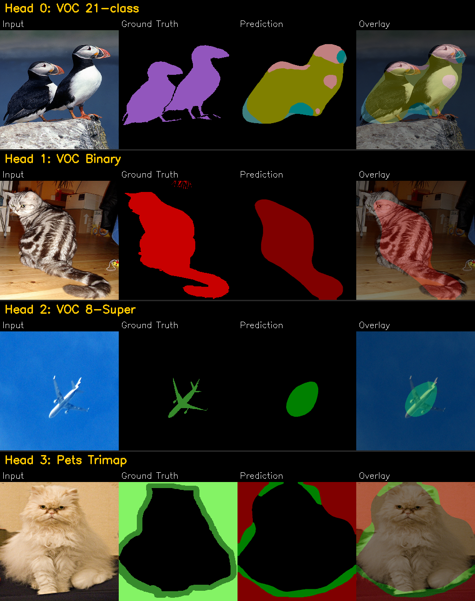
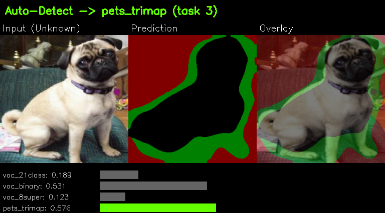
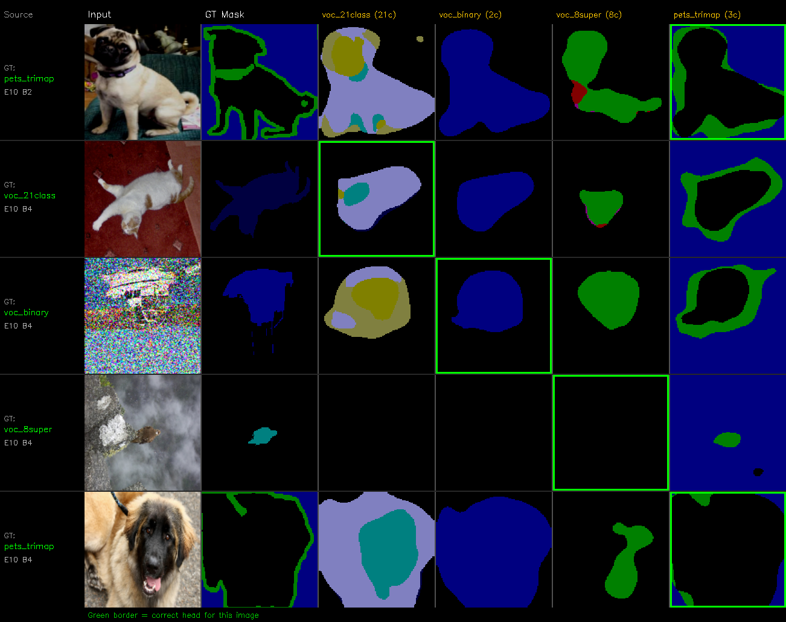

# Multi-Head Segmentation

Train one model on multiple segmentation datasets simultaneously. A shared backbone and FPN decoder extract features, while per-task lightweight heads produce class predictions. Each head learns its own task without interfering with the others.

## Architecture

```
                          ┌──────────────────--─────┐
      Input Image ──────► │   Shared Backbone       │  (any timm model: resnet50, efficientnet_b3, ...)
                          │   (ImageNet pretrained) │
                          └───────┬───────────────-─┘
                                  │  multi-scale features (C2, C3, C4, C5)
                                  ▼
                          ┌─────────────────--──────┐
                          │   Shared FPN Decoder    │  (lateral connections + top-down + fuse)
                          └───────┬────────────-────┘
                                  │  fused feature map
                  ┌───────────────┼───────────────┬───────────────┐
                  ▼               ▼               ▼               ▼
           ┌──────────┐   ┌──────────┐   ┌──────────┐   ┌──────────┐
           │  Head 0  │   │  Head 1  │   │  Head 2  │   │  Head 3  │
           │ 21 class │   │  2 class │   │  8 class │   │  3 class │
           └──────────┘   └──────────┘   └──────────┘   └──────────┘
            VOC Full       VOC Binary     VOC 8-Super    Pets Trimap
```

## Features

- **Shared backbone + shared decoder** -- heavy layers shared across all tasks, only lightweight classification heads are per-task
- **Learnable loss weighting** -- automatically balances task losses during training (Kendall et al., 2018); harder tasks get more weight
- **Balanced sampling** -- every batch has equal samples from all datasets regardless of dataset size
- **Dice + CrossEntropy loss** -- combined loss for better segmentation than CE alone
- **Auto-detect inference** -- run all heads on an unknown image, model picks the most confident head automatically (normalized entropy, fair across different class counts)
- **Live visualization** -- FIFO queue showing input + GT + all 4 head predictions side-by-side during training
- **Train/val split** -- automatic per-dataset split with separate validation loader
- **Mixed precision (AMP)** -- faster training on GPU
- **Any timm backbone** -- swap backbone by changing one config line
- **ONNX export** -- export any head for deployment

## Results

### Per-Head Inference

Each head produces segmentation masks for its own task. Columns: Input, Ground Truth, Prediction, Overlay.



### Auto-Detect Mode

When the task is unknown, the model runs all heads and picks the most confident one. Here it correctly identifies the image as a pet trimap (task 3):



### Training Visualization

During training, a live visualization grid shows input + GT mask + all 4 head predictions for recent samples. The green border marks the correct head:



## Project Structure

```
multihead/
├── config/
│   └── default.yaml              # all hyperparameters and dataset definitions
├── models/
│   ├── backbone.py               # shared timm feature extractor
│   ├── heads.py                  # FPN decoder + segmentation head
│   └── multi_head_seg.py         # combined multi-head model
├── dataloader/
│   └── multi_dataset.py          # per-task dataset, balanced sampler, train/val split
├── utils/
│   ├── losses.py                 # Dice + CE loss, learnable multi-task weighting
│   ├── metrics.py                # per-class IoU and Dice computation
│   └── visualize.py              # live training visualization queue
├── train.py                      # training script
├── inference.py                  # inference with manual or auto-detect head selection
├── prepare_data.py               # download sample datasets (VOC + Oxford Pets)
└── requirements.txt
```

## Data Format

Each dataset needs an `images/` and `masks/` directory. Images and masks are paired by filename stem (e.g., `images/001.jpg` matches `masks/001.png`).

```
data/
├── dataset_01/
│   ├── images/        # RGB images (png, jpg, etc.)
│   └── masks/         # single-channel masks, pixel value = class id (0 to N-1)
├── dataset_02/
│   ├── images/
│   └── masks/
├── dataset_03/
│   ├── images/
│   └── masks/
└── dataset_04/
    ├── images/
    └── masks/
```

Masks must be single-channel images where each pixel value is the class index (0-indexed). Different datasets can have different numbers of classes.

## Quick Start

### 1. Install

```bash
pip install -r requirements.txt
```

### 2. Prepare sample data (optional, for testing)

Downloads 10 images each from Pascal VOC 2012 and Oxford-IIIT Pets:

```bash
python prepare_data.py
```

This creates 4 datasets:

| Dataset | Source | Classes | Description |
|---------|--------|---------|-------------|
| dataset_01 | Pascal VOC 2012 | 21 | Full semantic segmentation |
| dataset_02 | Pascal VOC 2012 | 2 | Binarized (background / foreground) |
| dataset_03 | Pascal VOC 2012 | 8 | Remapped to super-categories |
| dataset_04 | Oxford-IIIT Pets | 3 | Trimap (pet / background / border) |

### 3. Configure

Edit `config/default.yaml` to point to your datasets and set the correct number of classes:

```yaml
datasets:
  - task_id: 0
    name: "my_dataset_A"
    root: "data/dataset_A"
    num_classes: 32
  - task_id: 1
    name: "my_dataset_B"
    root: "data/dataset_B"
    num_classes: 2
```

### 4. Train

```bash
python train.py --config config/default.yaml
```

Resume from a checkpoint:

```bash
python train.py --config config/default.yaml --resume checkpoints/last.pt
```

### 5. Inference

**If you know which task the image belongs to:**

```bash
python inference.py --checkpoint checkpoints/best.pt --task 0 --input image.png --output out/
```

**If you don't know (auto-detect):**

```bash
python inference.py --checkpoint checkpoints/best.pt --task auto --input image.png --output out/
```

The model runs all heads and picks the one with highest normalized confidence.

**Batch inference on a directory:**

```bash
python inference.py --checkpoint checkpoints/best.pt --task auto --input my_images/ --output out/ --overlay
```

**Export to ONNX:**

```bash
python inference.py --checkpoint checkpoints/best.pt --task 0 --export-onnx model_task0.onnx
```

### 6. Inference from Python

```python
import torch
from models import MultiHeadSegModel

model = MultiHeadSegModel(backbone_name="resnet50", num_classes={0: 21, 1: 2, 2: 8, 3: 3})
ckpt = torch.load("checkpoints/best.pt", weights_only=False)
model.load_state_dict(ckpt["model"])
model.eval()

image = torch.randn(1, 3, 512, 512)  # preprocessed + ImageNet-normalized

# Manual: pick a specific head
logits = model.forward_single_task(image, task_id=0)
pred = logits.argmax(dim=1)  # (1, 512, 512)

# Auto-detect: model picks the best head
logits, detected_task, confidences = model.forward_auto_detect(image)
print(f"Detected task: {detected_task}, confidences: {confidences}")
```

## Configuration Reference

All settings are in `config/default.yaml`:

| Section | Parameter | Default | Description |
|---------|-----------|---------|-------------|
| `model` | `backbone` | `resnet50` | Any [timm](https://github.com/huggingface/pytorch-image-models) model name |
| | `pretrained` | `true` | Load ImageNet pretrained weights |
| | `decoder_channels` | `256` | FPN decoder width |
| | `head_hidden` | `128` | Hidden channels in classification heads |
| | `shared_decoder` | `true` | `true` = one shared FPN, `false` = per-task FPN |
| `datasets[]` | `task_id` | - | Integer ID (0, 1, 2, ...) |
| | `name` | - | Display name for logging |
| | `root` | - | Path with `images/` and `masks/` subdirectories |
| | `num_classes` | - | Number of classes in this dataset |
| `training` | `img_size` | `[512, 512]` | Input resolution `[H, W]` |
| | `batch_size` | `16` | Total batch size (split equally across tasks) |
| | `epochs` | `100` | Total training epochs |
| | `lr` | `1e-4` | Learning rate (AdamW) |
| | `weight_decay` | `1e-4` | Weight decay |
| | `lr_scheduler` | `cosine` | `cosine` or `step` |
| | `warmup_epochs` | `5` | Linear warmup epochs |
| | `val_ratio` | `0.2` | Fraction of each dataset held out for validation |
| | `val_interval` | `5` | Validate every N epochs |
| `visualization` | `queue_size` | `5` | Number of recent samples in the live queue |
| | `interval_batches` | `50` | Update visualization every N batches |
| | `save_dir` | `vis` | Output directory for `live_queue.png` |

## Live Visualization

During training, `vis/live_queue.png` is continuously updated with the grid shown in the [Results](#training-visualization) section above. The green border marks the correct head for each image. Open the file in any image viewer -- it auto-refreshes as training progresses.

Also viewable in TensorBoard under the **Images** tab.

## Monitoring

```bash
tensorboard --logdir runs/
```

Tracks:
- Per-task training loss
- Learned task weights (from uncertainty weighting)
- Per-task validation mIoU
- Overall mIoU
- Live visualization grid

## How Auto-Detect Works

When you pass `--task auto`, the model runs the image through the shared backbone and decoder once, then through all heads. Each head's confidence is measured using **normalized entropy**:

```
confidence = 1 - entropy(softmax) / log(num_classes)
```

This produces a fair 0-1 score regardless of class count (a 2-class head and a 32-class head are compared equally). The head with the highest score wins.

## How Multi-Task Training Works

1. **Balanced batches** -- the sampler guarantees equal samples from every dataset in each batch (batch_size=16 with 4 tasks = 4 images per task)
2. **Shared forward pass** -- the backbone processes the entire batch once, then features are routed to the correct head per sample
3. **Learnable loss weighting** -- each task has a learned log-variance parameter; the total loss is `sum(exp(-s_t) * L_t + s_t)` where `s_t` adapts automatically so noisy/hard tasks don't dominate
4. **ImageNet normalization** -- images are normalized with ImageNet mean/std since the backbone is pretrained on ImageNet

## Author

**Gaurav Goswami** -- [GitHub](https://github.com/Gaurav14cs17)

## License

This project is licensed under the [MIT License](LICENSE).
